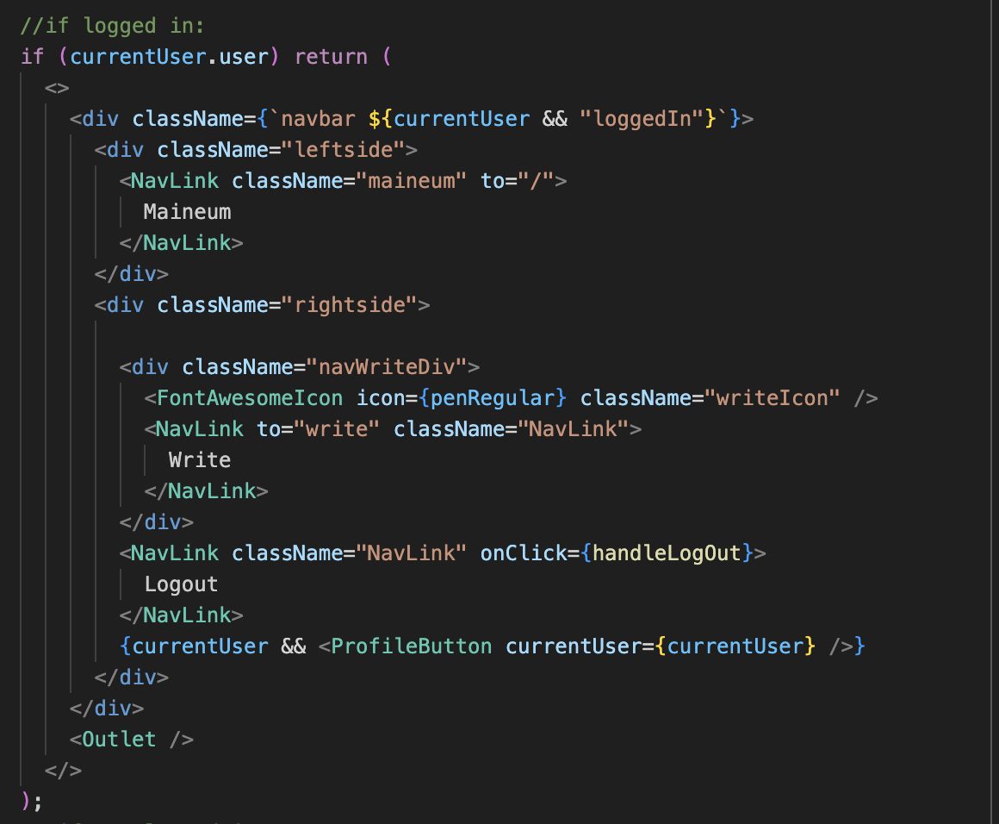
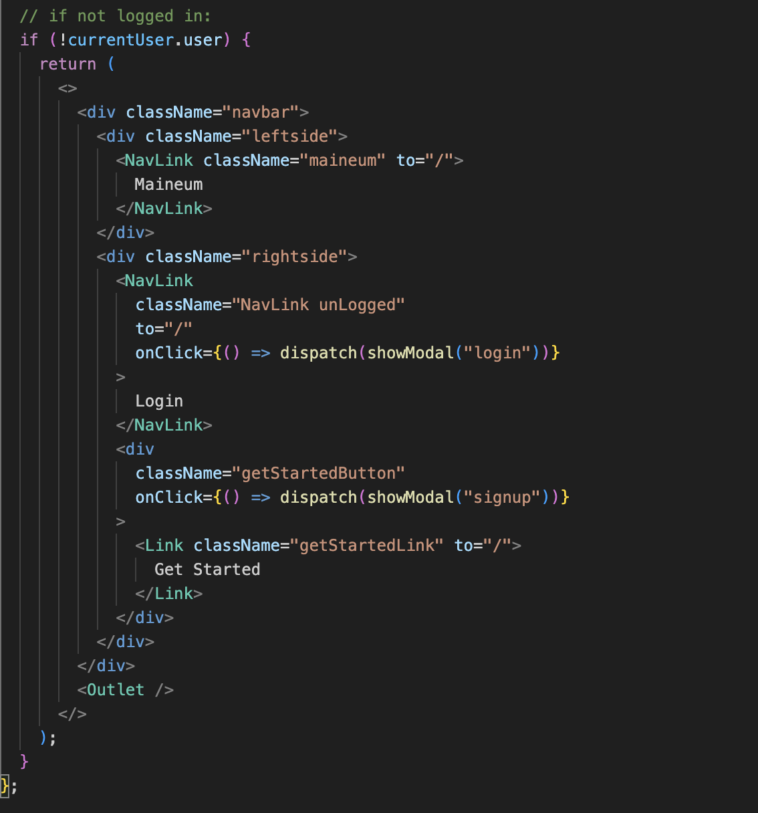
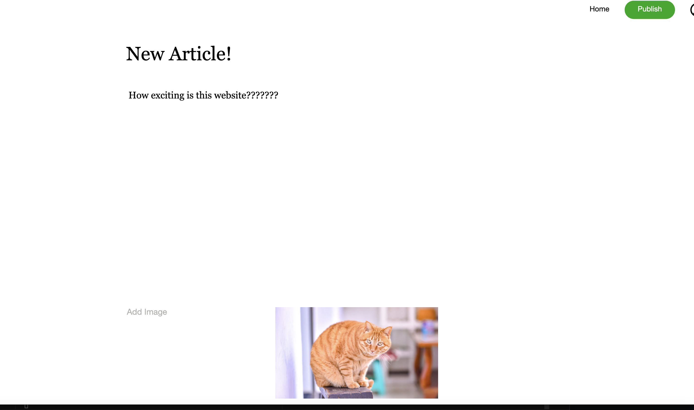
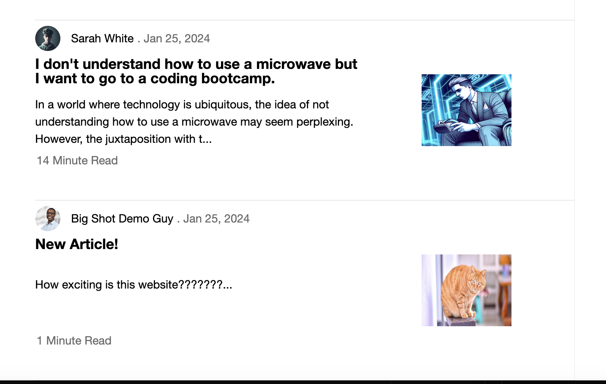
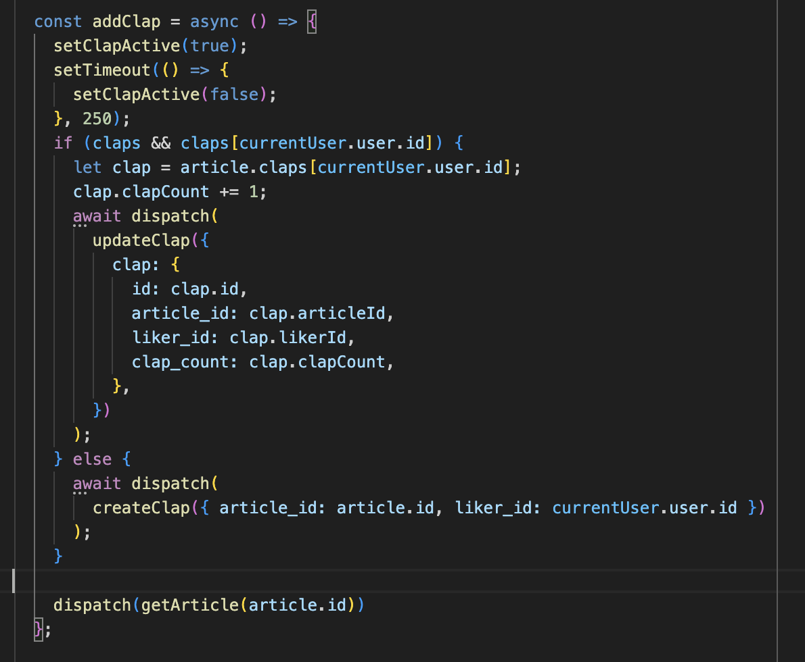
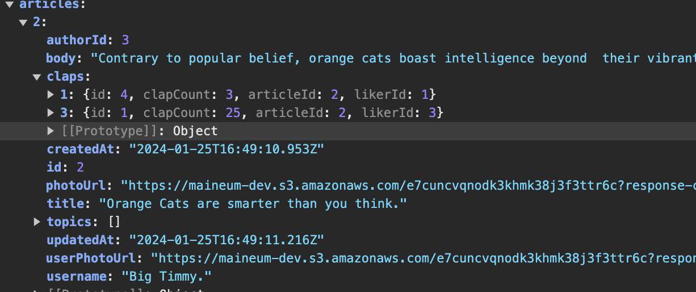

# WELCOME TO MAINEUM

#### Check out the [Live Site](https://maineum.onrender.com)

# Introduction 

#### Maineum is a clone of the website Medium. Medium is a website where users can create, publish, and interact with articles. Leading up to this project I found myself on Medium several times reading articles about different coding problems. I liked the minimalistic design, easy article creation tools, and often thought about writing my own articles once I get more experienced as a programmer. 

# Technologies used to build Maineum:

* ### Languages: JavaScript, Ruby, HTML, CSS
* ### Frontend: React-Redux
* ### Backend: Rails
* ### DataBase: PostgreSQL
* ### Hosting: Render.com
* ### Asset Storage: AWS Simple Cloud Storage (S3)

# Functionality 
## User Profiles 
### Users are able to create new profiles which will be saved the backend, persisted to the frontend, and can be used for future visits to the site. Limited functionality of the site is allowed for un-logged in users, full functionality (article creation/editing/deletion and adding 'claps') is reserved for logged in users. Different styling is applied depending on if user is logged in or logged out.

### Logged in Users will remain logged in through page refreshes thanks to the user authorization system implemented.

## Article Creation, Editing, and Deleting 
### Users can write and publish their own articles. The article creation page allows you to add a Title, Body, and an optional Image.

### Upon saving the article it will be stored into the data base and be presented with the other articles on the site. The uploaded image will be stored in the AWS S3 service.

### Dynamic information relating the article, such as author's username, photo, creation date, and etc, is displayed with the articles.

## 'Claps' (similar to 'Likes')

### Logged in users can add multiple claps (up to 50) to an article. Upon adding a clap the database will be updated and the UI will respond by updating the presented clap count.

### To reduce bloating in the database: instead of each 'Clap' being saved as an individual entry, a user and their claps on a particular article will be saved as one entry, with the 'clap amount' updating as the user adds more claps.

### You can see here in this snippet of the React-Redux state how when an article is fetched from the backend I utalize the PostgreSQL relational database functionality to pull the claps (and author inormation) along with the article data. The claps belonging to the article are pulled, and the total count is tallied to be presented in the UI.

## Future Features To Come!
### Dear users, 
### I know you demand more from Maineum!!
### On the docket for upcoming features are:
* ### Search Bar
* ### Comments and replies
* ### Article saves
* ### User profile page